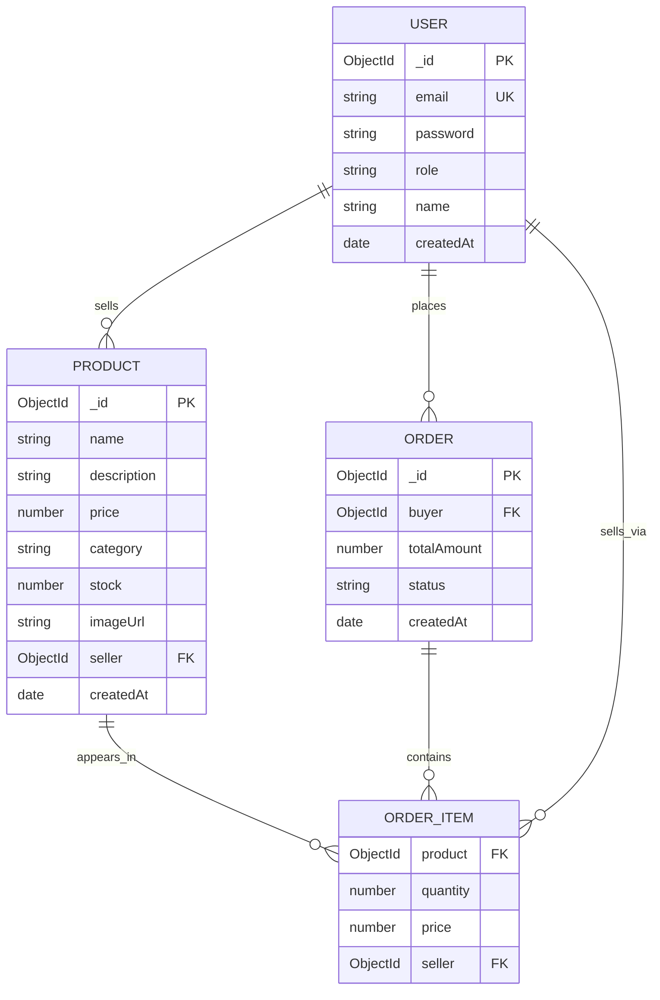

# Entity-Relationship Diagram

```mermaid
erDiagram
    USER {
        ObjectId _id PK
        string email UK
        string password
        string role
        string name
        date createdAt
    }
    
    PRODUCT {
        ObjectId _id PK
        string name
        string description
        number price
        string category
        number stock
        string imageUrl
        ObjectId seller FK
        date createdAt
    }
    
    ORDER {
        ObjectId _id PK
        ObjectId buyer FK
        number totalAmount
        string status
        date createdAt
    }
    
    ORDER_ITEM {
        ObjectId product FK
        number quantity
        number price
        ObjectId seller FK
    }
    
    USER ||--o{ PRODUCT : sells
    USER ||--o{ ORDER : places
    PRODUCT ||--o{ ORDER_ITEM : appears_in
    ORDER ||--o{ ORDER_ITEM : contains
    USER ||--o{ ORDER_ITEM : sells_via
```
